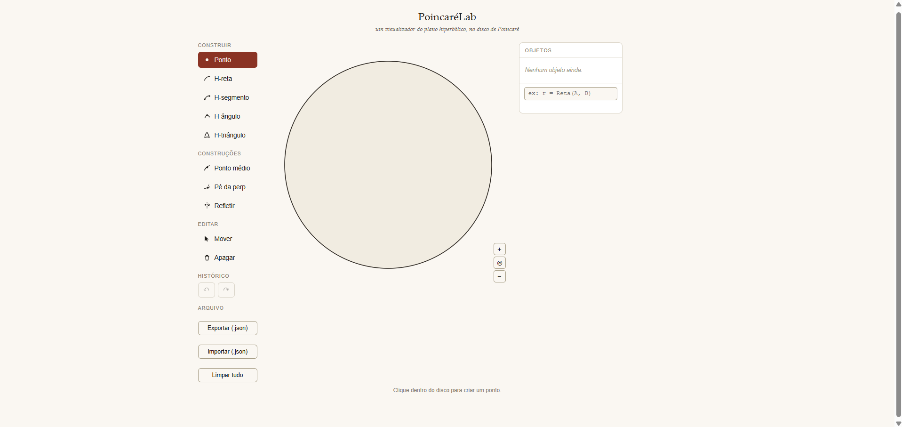

# PoincaréLab

Um visualizador interativo do plano hiperbólico, construído sobre o modelo do disco de Poincaré inspirado no GeoGebra, mas voltado especificamente para geometria hiperbólica.

Desenvolvido como parte de um projeto de Iniciação Científica em Matemática Aplicada e Computacional, para apoiar visualmente o estudo de geometria euclidiana e hiperbólica.

**[➜ Experimente ao vivo](https://nicolasponge.github.io/PoincareLab/)** <!-- TODO: link do GitHub Pages, quando publicado -->

 <!-- TODO: adicionar uma captura de tela -->

## O que é

O plano hiperbólico não pode ser desenhado fielmente numa folha de papel a distância "cresce" perto da borda de um jeito que a intuição euclidiana não prevê. O modelo do disco de Poincaré contorna isso: representa o plano hiperbólico inteiro dentro de um disco euclidiano comum, onde retas viram arcos de círculo (ou diâmetros), e ângulos e distâncias seguem fórmulas específicas.

O PoincaréLab deixa construir e manipular objetos hiperbólicos diretamente nesse modelo, clicando, arrastando e digitando comandos sem precisar calcular nada à mão.

## Funcionalidades

**Construção**
- Pontos e pontos ideais (Ω) (pontos "no infinito", sobre a borda do disco)
- H-retas, h-segmentos e h-triângulos
- H-ângulos, com medida calculada e exibida automaticamente
- Ponto médio hiperbólico, pé da perpendicular, reflexão através de uma h-reta

**Edição**
- Mover pontos (com *snap* automático sobre h-retas/h-segmentos existentes)
- Cor, espessura e estilo de traço (sólido/tracejado/pontilhado) por objeto
- Visibilidade independente de objeto, rótulo e valor exibido
- Rótulos arrastáveis livremente
- Zoom (scroll ou botões) e desfazer/refazer (Ctrl+Z / Ctrl+Shift+Z)
- Exportar/importar a construção inteira como `.json`

**Linha de comando** (estilo GeoGebra)

```
A = Ponto(0.3, 0.2)
r = Reta(A, B)
s = Segmento(A, B)
alpha = Angulo(A, V, B)
M = Medio(A, B)
Q = Perpendicular(A, B, P)
R = Refletir(A, B, P)
T = Triangulo(A, B, C)
```

Também é possível **resolver posições por restrição de ângulo**, o comando desliza ou reposiciona um ponto até uma condição de ângulo ser satisfeita:

```
Q = Reta(A, B) | Angulo(A, Q, B) == 90
r = Reta(A, B) | Angulo(A, B, C) == 45
r = Reta(A, B) | Angulo(A, B, C) == 45 [2]   " escolhe a 2ª solução, quando há mais de uma
```

## Fundamentação matemática

O app segue o modelo do disco de Poincaré como apresentado em:

> AGUSTINI, E. *Introdução à Geometria Hiperbólica Plana*. FAMAT/CEaD-UFU, 2022.

| Conceito | Base |
|---|---|
| Pontos, h-retas (diâmetros / arcos ortogonais à borda) | Definição direta do modelo (Cap. 4.2) |
| Distância hiperbólica | Razão cruzada com pontos ideais, $d(A,B)=\ln\!\left(\frac{\overline{AB'}\cdot\overline{BA'}}{\overline{AA'}\cdot\overline{BB'}}\right)$ (Cap. 4.2) |
| Ângulo hiperbólico | Coincide com o ângulo euclidiano entre as tangentes (modelo conforme, Cap. 4.2) |
| Ponto ideal (Ω) | Classe de equivalência de semirretas paralelas (Cap. 5.2) |

Construções sem fórmula fechada no livro-base (ponto médio, pé da perpendicular, reflexão, deslocamento por direção fixa, resolução de restrições) foram implementadas via busca de raiz numérica e/ou isometrias de Möbius, com demonstração própria de corretude — ver `docs/fundamentacao-matematica.md` para os detalhes. <!-- TODO: criar esse arquivo se quiser publicar as demonstrações -->

## Como rodar

Não há build nem dependências. Basta abrir `index.html` num navegador, ou servir a pasta localmente:

```bash
python3 -m http.server 8000
# depois abra http://localhost:8000
```

## Estrutura do projeto

```
poincarelab/
├── index.html      # estrutura da página e barra de ferramentas
├── style.css        # aparência (tema claro, cores por tipo de objeto)
├── app.js            # toda a lógica: geometria, renderização, interação, comandos
├── LICENSE
└── README.md
```

`app.js` é organizado em seções comentadas, na ordem: estado e histórico → nomenclatura de objetos → geometria do disco de Poincaré (funções matemáticas puras) → renderização → interação do usuário → painel de propriedades → zoom → sistema de comandos.

## Tecnologia

JavaScript puro (sem frameworks), renderização via SVG nativo. Nenhuma dependência externa.

## Licença

MIT — veja [LICENSE](LICENSE).
